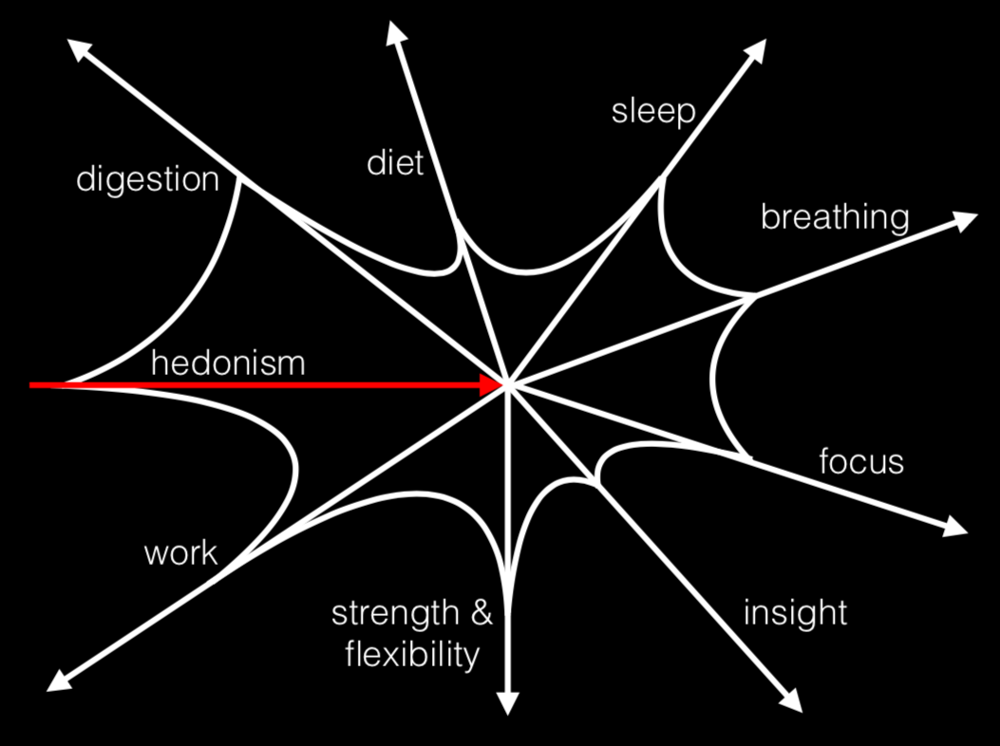

# Die Standing Up

The working title of a book (or some other medium) containing a conceptualization of health as a totality, with a specific role for meditation. For now, I'll just braindump notes straight into this README.

## The Working Title

"Die Standing Up" is not literal. It is hard to die standing up, working to better the world, if you're dying of stage 4 cancer. The concept of "standing up" has more to do with how we live up until the point of death, or near-death, and how we perceive death along the way.

The image is rather the opposite of wounds-on-the-back, seen in battle when our protagonist cowers and flees. To stand up is to face our difficulties head-on.

## Cross-cutting Concepts

Some concepts cut across the entirety of our existence when we model it in terms of health and well-being. I've called these out below as "Spectrums", "The Self->Others Spectrum (Self Support to Service)", "Maturity Models", "Dependency Models", and "Self Experiment".

### The Spectrums

There are very few binaries in this universe. We often pit two ends of a spectrum against one another, as binaries: stupid and intelligent, healthy and unhealthy. But this simply isn't how the world works. Most of our time is spent somewhere in the middle. Sometimes we are regressing and sometimes we are progressing and it's more important to be aware of our trajactory and work to improve it than it is to be in the "good" category and consider ourselves "cured." The work is never really finished, and we need to acknowledge that up-front.

### The First Spectrum: Self Support to Service

This idea underpins all the others but it may be one of the most difficult to digest, for some. The spectrum which is the foundation of all other work we do on ourselves is not a spectrum between two polar opposites but crossing two halves.

On one half, we have "self support". Self Support is working on ourselves, for ourselves. So that we can be physically strong enough to work through the day without encountering exhaustion. So that we are mentally strong enough to get out of bed in the morning. So that we can lead healthier lives. These examples, of course, are cursed with the tendency to create binary imagery as soon as they're evoked: Someone who can easily get out of bed in the morning on one hand, and someone crippled by chronic depression on the other. As with all other work, this is a false dichotomy, and one we will have to fight against.

On the other half of the spectrum is "service". The idea of Service is harder to understand than Self Support. Self Support is what we do when we go to the gym, eat a lot of green vegetables, meditate, and take our medicines on time. Service is far more abstract. It is the idea of doing work _for others_, and I take it as a forgone conclusion of living a healthy life. Again, there are no binaries. We may very well spend a significant portion of our lives, as healthy and productive adults, living for ourselves and things we consider "ours" --- but the progress is always toward selflessness and the service of others, ultimately.

NB: This concept will require a lot of expansion and has a great deal to do with higher order functioning.

Crossing this spectrum is necessary for everyone. Even someone very fortunate, born into a comfortable and productive environment, requires the support of her parents (and, therefore, her own self-support) before she can grow into a selfless adult. It's also unlikely someone will burst onto the scene, in early adulthood, some sort of saint. Most people will grapple with various forms of selfishness throughout their lives. This is completely natural.

The reason Self Support precedes Service is simply because it cannot be any other way. A person may have all the volition to help others, to serve others, to serve humanity. But if that person is not physically able to do these things or mentally unfit, they must first get themselves above water. The old cliche "a drowning person cannot save another drowning person" applies.

NB: It was brought to my attention (in response to a recent article I wrote, regarding public service and "service politics/leadership") that this word has all sorts of negative, self-serving connotations in India. Somehow, it will need to be expounded upon that when a person gives true Service it does not serve that person in any visible way. It is unlikely that they will even claim to be performing "service" of any kind. To take credit for the service one provides is to slip back down the spectrum. Of course, this is also expected to happen to some degree; we are none of us born saints.

### Maturity Models (Measuring Progress)

There is of course not a single spectrum for health. No two people will cleanly fit to the left or right of one another on a spectrum from "unhealthy" to "healthy". It is better to model one's personal health with a maturity model (or equivalent) which incorporates the dependencies between different aspects of health but keeps them separate, regarding progress.

### Dependency Models

Different aspects of health affect other aspects in expected and (perhaps) unexpected ways. Anecdotally, my friend Grace once pointed out that she would exercise heavily in fits and starts, as we all do, but that she noticed when she _was_ exercising heavily that she couldn't bring herself to eat a greasy hamburger like the two of us were meeting over at the time of the conversation.

- _Gut_, Julia Enders (digestion and mental health)
- anecdote: acute depressive symptoms on my ability to complete a long run
- asthma => running => sleep => meditation => mental health => running => asthma (loops)

This section will require some sort of mind map visualization of the dependency graph. It may serve to create many of such mind-maps and offer them as alternative ways of viewing these interdependencies.

### The Need for Self-Experiment

There is a danger within this concept. I have seen people misconstruing "self experiment" with much more dangerous ideas, like a personal tendency to "self medicate" or "self heal". These are not the same and should never be confused as such. The false ideals which cause someone to self medicate, for example, are those which put an unhealthy distrust in the scientific community and data-backed research in human health, in general. "Self experiment" is really the opposite of this.

Start with the science. Trust that humanity is doing its utmost to work toward a healthier, happier collective and global community. Read the science which pertains to your personal health problems or goals. Hard science, in the form of white papers and reproducable experiments, is often best. But aggregate science, in the form of books by doctors and scientists working in the field, is often how many of us must get glimpse of the current standard of scientific truth pertaining to human health and well-being.

Beyond this, however, we must acknowledge that data-based science can never be about _you_. Your body is different, your body is specific to you, and you will need to "experiment" on it to see what makes you feel healthiest. A "clean room" for your experiments is helpful: reduce the number of variables around the thing you are trying to test on yourself. Want to see how much value you get out of running three times a week? Don't change your diet too much. Want to see how much value you get out of a small meditation practice of Anapana twice a day for ten minutes? Stick to this schedule and keep your diet, exercise, and sleep as fixed as possible. Take notes; a journal is a much more reliable way to remember how you felt last week than your own memory.

Self-experiment itself, of course, lives on a spectrum as well: On one end, we have the skeptical analysis of a full experiment, intended to answer the question of "does this work or not?" If we are convinced of the value of a thing (going to sleep at the same time every night, a particular form of exercise, a particular diet, meditation, etc.) then we must walk down the spectrum toward _Effective Practice_: The meditation we do when we begin our practice will be very unlike the meditation we do in five years, if we keep up with the practice. What starts out as jogging for cardiovascular health may evolve into running a marathon.

- Tennis video of effective practice (TODO: look this up --- TDD?)

## Diet and Supplements

- personal experience with diets:
  - "The New York": high-priced meals eaten in restaurants containing a lot of meat
  - ayurvedic: extremely specific, high-vegetable content
  - vegetarian: no particular rules, eggs included
  - home-cooked vs. restaurant: similar foods feel different (better) when you make them yourself
  - Okinawan: the healthiest diet on the planet
- Vitamin D for Indians (ref: _Skin_ and _Genetics of Health_, Sharad Paul): arguably the reason India never wins in the Olympics
- _Minding My Mitochondria_, Terry Wahls: the high-vegetable diet that saved her brain from rapid deterioration, now in clinical trials

## Medicine

- "if something is wrong, go see a doctor and follow her advice" is surprisingly effective advice
- asthma example: asthalin vs. preventative

## Sleep

- need an alernative resource to _Why We Sleep_ because it has all the facts but it's such a shit book
- jet lag
- coffee, caffeine, etc.

## Exercise

- (A) Find Inspiration (B) Find Systems
  - For example: _Born to Run_ + _What I Talk About When I Talk About Running_ => Nike+, Strava, Runkeeper, Garmin, etc.
- Categories? Strength, Stamina, Aerobic, Flexibility, Breathing

## Mind-Body

- Spectrum: "meditative" => mindfulness => meditation
  - plot practices on this spectrum, provide specific resources and alternatives
- _The Body Keeps the Score_, Besser A van der Kolk (trauma)
- _Altered Traits_, Goleman (science of meditation)
- _How To Change Your Mind_, Pollan (pop science of psychedelics)
- _Buddha's Brain_ ?
